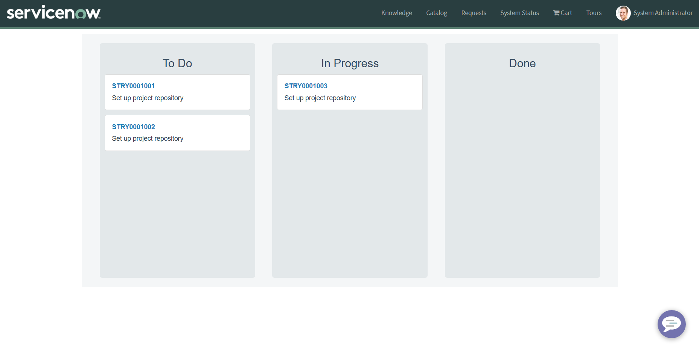
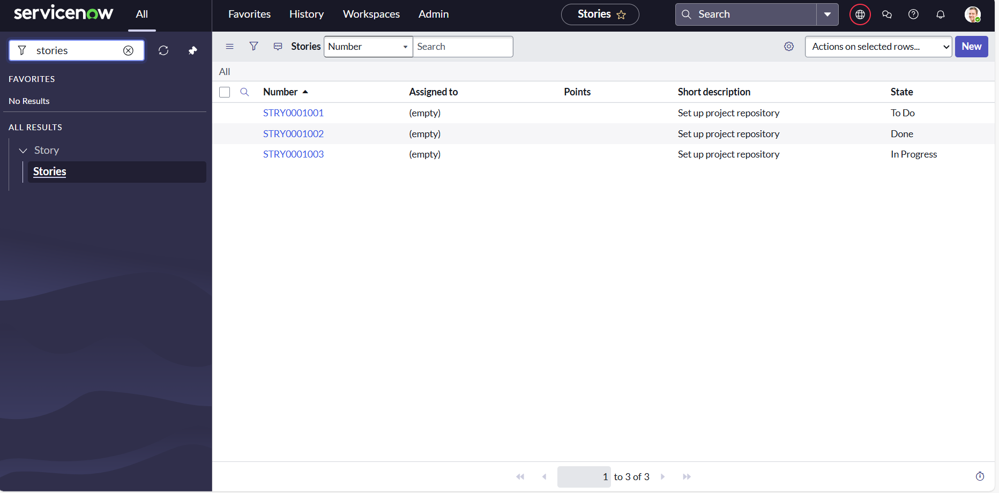
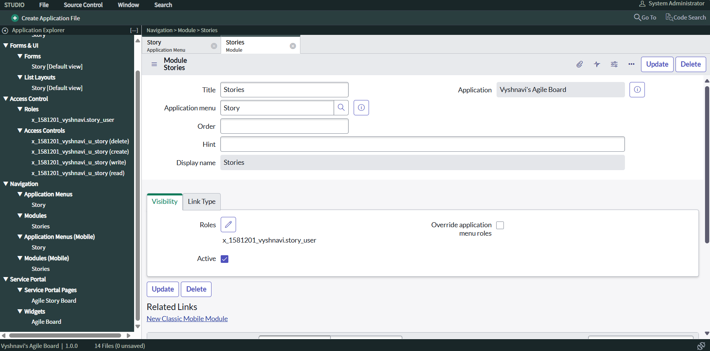
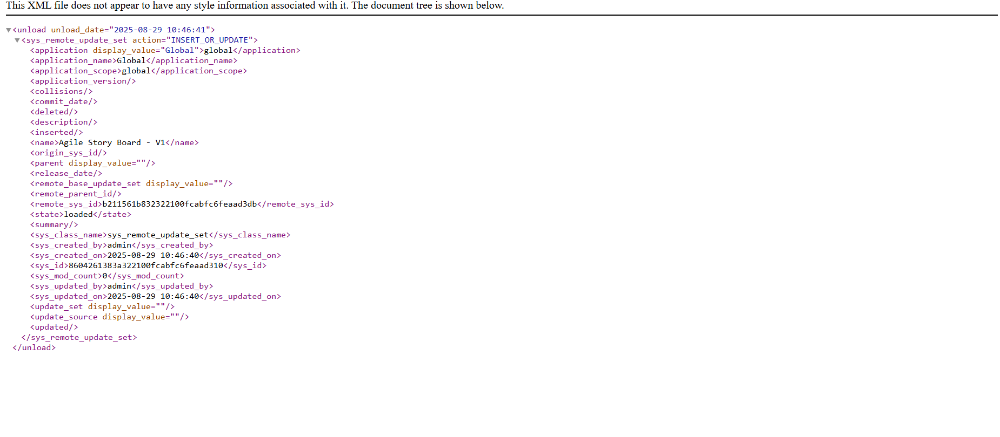

# 📌 Visual Agile Story Board for ServiceNow  

A **drag-and-drop Agile Story Board** built on ServiceNow’s Service Portal. This project showcases the ability to design custom tables, build widgets, and deliver a dynamic, interactive UI for agile story tracking.  

🔗 **Live Project:** [Agile Board on ServiceNow](https://dev290679.service-now.com/sp?id=agile_board)  

---

## ✨ Features  

- 🎯 **Custom Story Table**: Stores stories with fields like short description, points, assigned user, and state.  
- 🗂 **Kanban-Style Columns**: To Do, In Progress, and Done.  
- 🖱 **Drag-and-Drop Functionality**: Move stories between states dynamically.  
- 🖥 **Custom Widget**: Built with HTML, CSS, client, and server scripts.  
- ⚙️ **Scoped Application**: Fully contained and deployable via Update Sets.  

---

## 🚀 Setup & Development Steps  

1. **Update Set** → Created `Agile Board V1` update set.  
2. **Scoped Application** → Created `My Agile Board` scoped app.  
3. **Data Model** → Added a `Story` table with:  
   - Short description (String)  
   - Points (Integer)  
   - Assigned to (Reference → User)  
   - State (Choice: To Do / In Progress / Done)  
4. **Service Portal** → Built page `agile_board` and widget `Agile Board`.  
5. **Widget Code** → Implemented drag-and-drop logic with GlideRecord updates.  

---

## 🖼 Screenshots  

| View | Screenshot |  
|------|------------|  
| Agile Board Portal Page |  |  
| Dragging a Story |  |  
| Story Table in Studio |  |  
| Update Set Export |  |  

---

## 📖 Usage  

1. Create sample stories (`To Do`, `In Progress`, `Done`).  
2. Open the board:
3. https://dev290679.service-now.com/sp?id=agile_board
  3. Drag cards across lanes → their state updates automatically.  

---

## 📦 Deployment  

- Update set: **Agile Story Board**  
- Exported as XML for re-use in other instances.  

---

## ⚡ Troubleshooting  

- **Invalid table error** → Update `myTableName` in widget’s server script to your story table name (`x_12345_my_agile_board_story`).  
- **Widget/table not visible** → Switch application scope to `My Agile Board`.  
- **Module not refreshing** → Run `cache.do` or re-login.  

---

## 👩‍💻 Author  

Developed by **Vyshnavi**  
- ServiceNow Certified System Administrator (CSA)  
- ServiceNow Certified Application Developer (CAD)  

---

1. Create sample stories (`To Do`, `In Progress`, `Done`).  
2. Open the board:  
